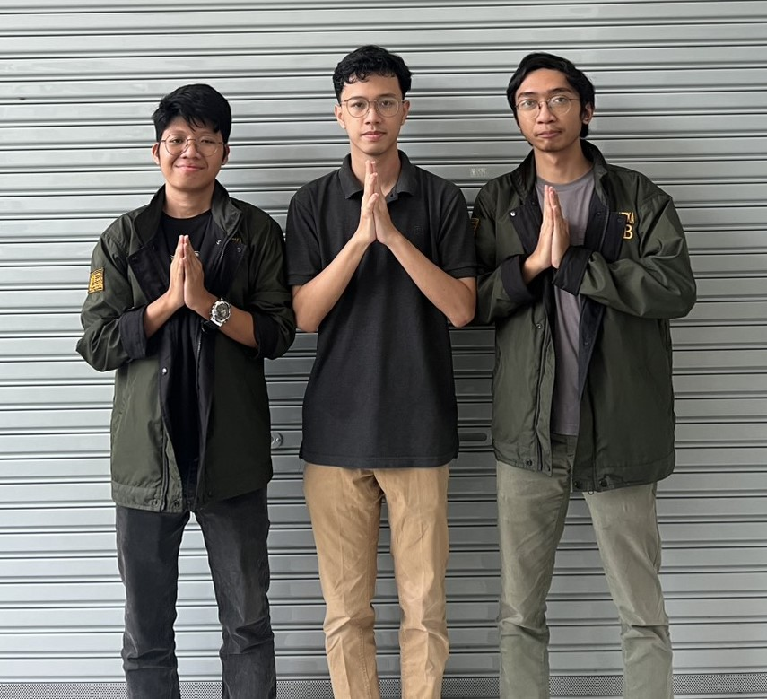
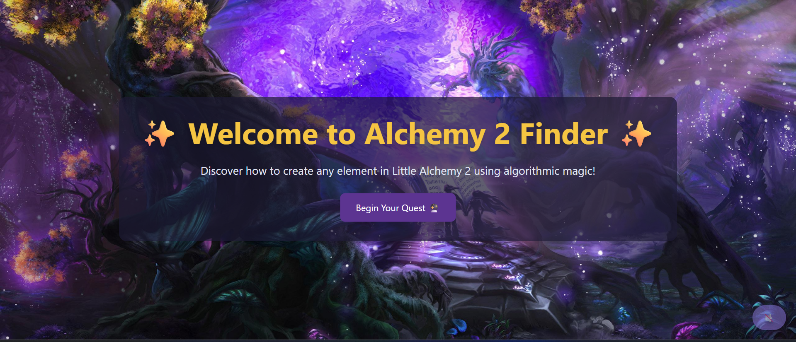
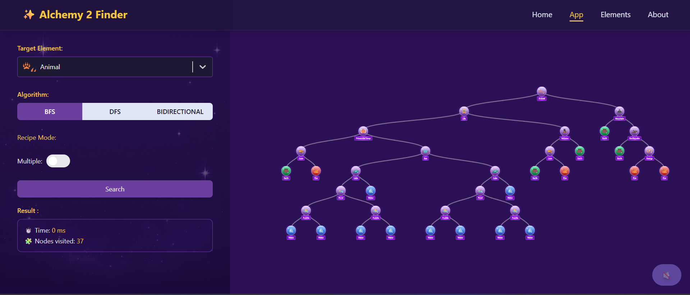
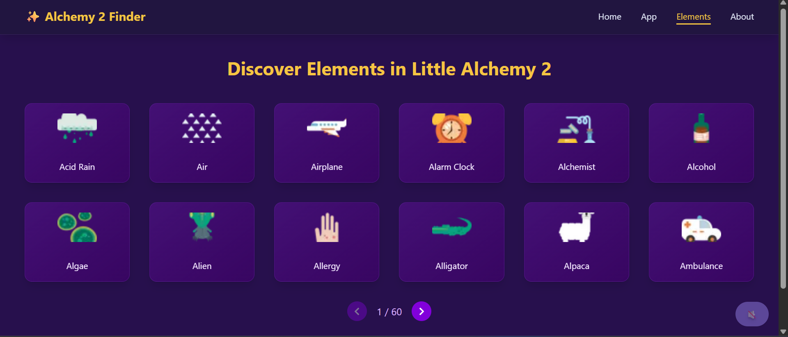
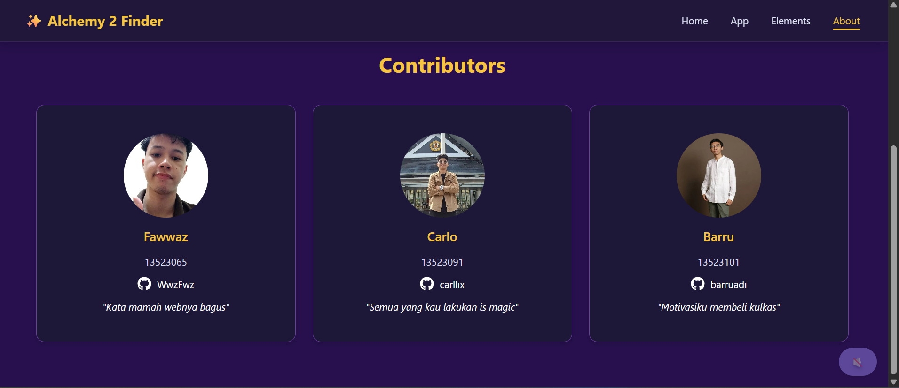

<h1 align="center">Tugas Besar 2 IF2211 Strategi Algoritma</h1>
<h2 align="center">Semester II tahun 2024/2025</h2>
<h2 align="center">Pemanfaatan Algoritma BFS dan DFS dalam Pencarian Recipe  pada Permainan
 Little Alchemy 2
</h2>

<p align="center">
  
</p>

## Table of Contents

- [Description](#description)
- [Requirements & Installation](#requirements--installation)
- [How to Run](#how-to-run)
- [Preview](#preview)
- [Author](#author)

## Description

This project implements Breadth-First Search (BFS) and Depth-First Search (DFS) algorithms to assist players of Little Alchemy 2 in finding optimal combinations of base elements to create new elements. The application presents the results as a visually engaging, animated recipe tree to enhance understanding of each algorithm’s pathfinding process.

The system is built with a **Next.js (React)** frontend and a **Golang** backend, and is fully containerized with **Docker**.

> ✅ This application has been fully deployed and can be accessed directly without local setup:
> 
> - 🌐 Frontend: [https://tubes2-fe-bfc.vercel.app](https://tubes2-fe-bfc.vercel.app)  
> - ⚙️ Backend: [https://tubes2bebfc-production.up.railway.app/](https://tubes2bebfc-production.up.railway.app/)

### Problem Solving Steps with BFS Algorithm
Algoritma BFS pencarian pohon resep menggunakan metode rekursif. Metode rekursif akan memanggil fungsi dirinya sendiri dengan parameter yang sudah diolah. Pada setiap fungsi memasukkan semua gabungan elemen yang menghasilkan elemen tersebut yang didapat dari RecipeMap untuk memastikan pencarian dilakukan secara meluas. Akan tetapi, sebelum dimasukkan akan dipastikan terlebih dahulu tier lebih rendah dari tier parent-nya. Setiap children akan di-assign ke worker dari goroutine untuk mempercepat pencarian dengan multithreading.

### Problem Solving Steps with DFS Algorithm
Algoritma DFS dalam pencarian pohon resep juga menggunakan metode rekursif, namun pendekatannya berbeda dengan BFS. Metode rekursif pada DFS akan memanggil fungsi dirinya sendiri untuk mengeksplorasi jalur pencarian secara mendalam sebelum berpindah ke jalur lainnya. Pada setiap pemanggilan fungsi, sistem akan mengambil seluruh kombinasi elemen dari RecipeMap yang dapat membentuk elemen tersebut. Namun, sebelum kombinasi tersebut ditelusuri lebih lanjut, terlebih dahulu akan diperiksa apakah tier dari elemen yang akan ditelusuri lebih rendah dari tier parent-nya, untuk mencegah pencarian yang berputar. DFS akan menelusuri satu cabang pencarian hingga ke elemen paling dasar sebelum kembali (backtrack) dan melanjutkan ke kombinasi lain yang belum dieksplorasi. 

## Built With

- [NextJS](https://nextjs.org/docs)
- [Tailwind](https://tailwindcss.com/)
- [React D3 Tree](https://bkrem.github.io/react-d3-tree/docs/)
- [GO Lang](https://go.dev/)

## Requirements & Installation

To run this project, the following tools must be installed on your system:

- **[Node.js](https://nodejs.org/)**  
  Required to run JavaScript on the server side and manage frontend packages (React/Next.js).

- **npm (Node Package Manager)**  
  Comes with Node.js. Used to install frontend dependencies.

- **[Go ≥ v1.18](https://golang.org/dl/)**  
  Required to build and run the backend service written in Go.

- **[Docker](https://www.docker.com/products/docker-desktop/)**  
  Used to containerize the frontend and backend for unified deployment and testing.

> ⚠️ **NOTE:**  
> It is highly recommended to install **Docker Desktop** before running the project to avoid environment mismatches.  
> 👉 [Download Docker here](https://www.docker.com/products/docker-desktop/)

## How To Run (Local)

### Run Without Docker

**Frontend:**

1. Clone the Frontend Repository:

```bash
git clone https://github.com/carllix/Tubes2_FE_BFC
```

2. Navigate to the frontend directory:

```bash
cd Tubes2_FE_BFC
```

3. Install all required packages:

```bash
npm install
```

4. Create .env.local file and set backend URL

```bash
NEXT_PUBLIC_BACKEND_URL=http://localhost:8080
```

5. Start the Next.js development server:

```bash
npm run dev
```

**Backend:**

1. Clone the Backend Repository:

```bash
git clone https://github.com/barruadi/Tubes2_BE_BFC
```

2. Navigate to the backend directory:

```bash
cd Tubes2_BE_BFC
```

3. Start the Golang backend server:

```bash
go mod download
go run ./src

```

> Open the application in your browser: [http://localhost:3000](http://localhost:3000)

### Run With Docker

> ⚠️ **Make sure Docker Desktop is installed and running before executing the following steps.**

**Frontend:**

1. Clone the Frontend Repository:

```bash
git clone https://github.com/carllix/Tubes2_FE_BFC
```

2. Navigate to the frontend directory:

```bash
cd Tubes2_FE_BFC
```
3. Create a .env.production file and define the backend URL:
```bash
NEXT_PUBLIC_BACKEND_URL=http://localhost:8080
```
4. Build and run the Docker container

```bash
docker compose up --build
```

**Backend:** 

1. Clone the Backend Repository:

```bash
git clone https://github.com/barruadi/Tubes2_BE_BFC
```

2. Navigate to the backend directory:

```bash
cd Tubes2_BE_BFC
```

3. Build and run the Docker container

```bash
docker compose up --build
```

> Open the application in your browser: [http://localhost:3000](http://localhost:3000)

## Preview

### Home Page



### App Page



### Elements Page



### About Page



## Author

| **NIM**  | **Nama Anggota**     | **Github**                              |
| -------- | -------------------- | --------------------------------------- |
| 13523065 | Dzaky Aurelia Fawwaz | [WwzFwz](https://github.com/WwzFwz)     |
| 13523091 | Carlo Angkisan       | [carllix](https://github.com/carllix)   |
| 13523101 | Barru Adi Utomo      | [barruadi](https://github.com/barruadi) |
